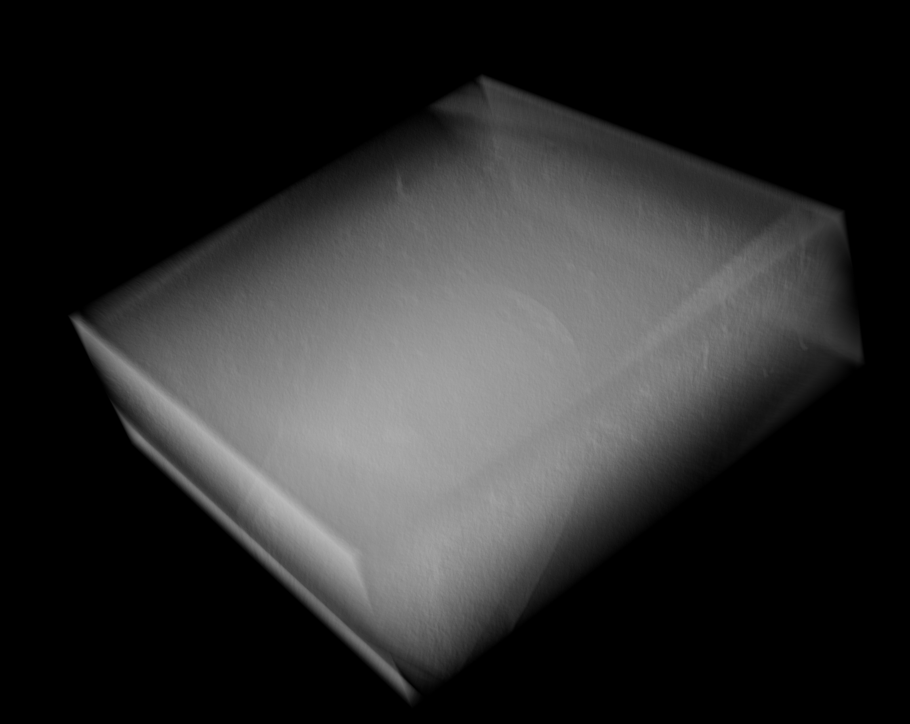
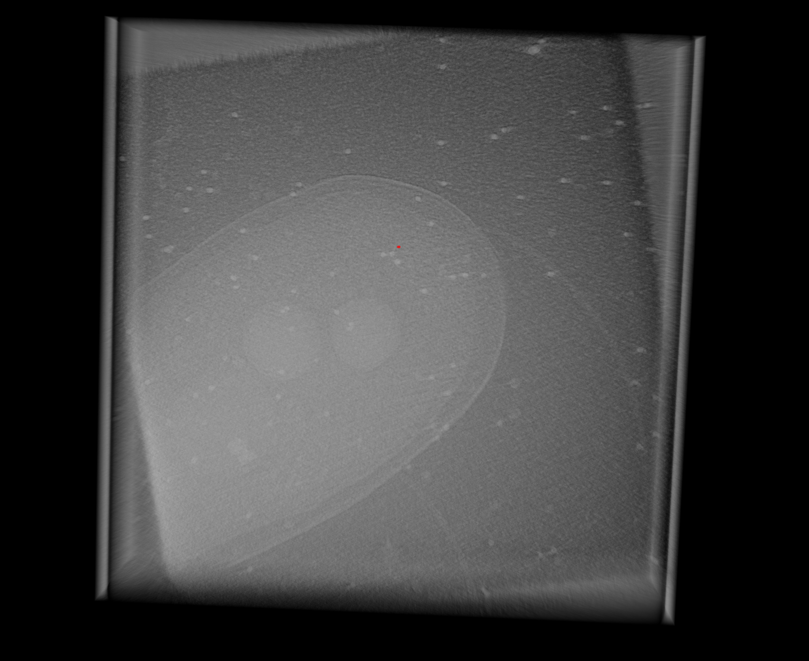
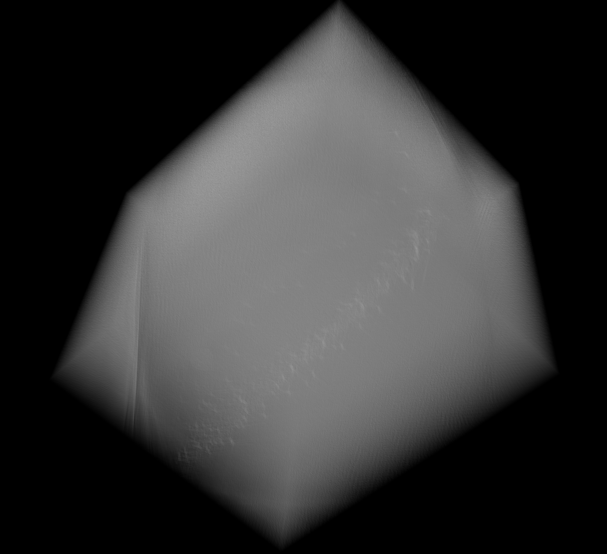
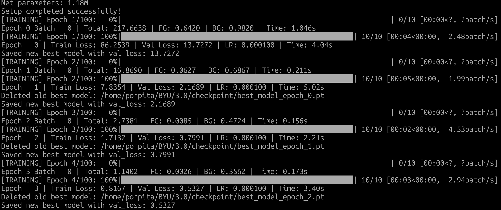

***WORK IN PROGRESS—core pipeline functions but major features incomplete***

This repo contains code for detecting bacterial flagellar motors in cryo-tomograms using deep learning segmentation methods. Active development is in v3.0; earlier versions are backlogged for reference.  
**Datasets are published on Kaggle and are not included in the repo:**  
https://www.kaggle.com/competitions/byu-locating-bacterial-flagellar-motors-2025/data

|  |  | |
|:---------------------------------------------:|:--------------------------------------------:|:-------------------------------------------:|
| *Figure 1: Visualisation of the tomogram*     | *Figure 2: Side view*                        |*Figure 3: Most are more difficult to see*   |

## TO DO LIST

- Find the reason for the tensor shape mismatch during late stages of training. Currently the model can train successfully for about 30 epochs on batch_size = 1 and show meaningful progress in the obvious reduction of losses. This means that the model architecture is fine and backpropagation is working as intended.
- Create a better inference pipeline. I am currently using the slidingwindow inferer from MONAI but I cannot guarantee that it works properly given how customised the rest of the pipeline is.
- Change the ComprehensiveLogger to include methods to write a custom CSV file to track the training progress. This will make the later stages of visualisation easier.
- Try to implement more methods of data augmentation. Currently we only have mixup, rotate, and flip.
- Try to generate gaussian spheres as target rather than single coordinates to make use of the dense target block created.
- Experiment with other architectures and methods of ensembling.

  

<em>Figure 4: As you can see, the loss is decreasing quite drastically. Confirming that the model architecture and backpropagation is working as intended</em>

# The Method

The nature of the task is quite interesting since it can either be a detection or a segmentation problem depending on your implementations. Both methods can work here since the target is a single pixel.

---

## --The Model--

The architecture of the model is based on the SegResNet architecture which combines encoder-decoder segmentation networks (similar to SegNet) with residual network (ResNet) block. I used the same architecture from MONAI but also implemented a form of deep supervision. In addition to the loss calculated at the final output of the network, I designed a dedicated convolution block for the penultimate layer that will convert the 16 channel feature map into the 2 channel target block.

Speaking of target blocks, the method that I implemented is arguably inefficient and wasteful. However, I believe this will provide more flexibility down the line. Currently, my method is to create a 2 channel tensor that matches the shape of the output, and change the pixel of the motor to 1 and leave the rest to 0 (background class). Since the number of background pixels is signficantly higher than the number of mmotor pixels, I applied weighting to both classes. This approach is quite wasteful if we are just using a single pixel as the target. Down the line, I plan to increase the size of the target by implementing gaussian balls as the target with the actual coordinates as the centre. Since, realistically speaking, the motors are not really one pixel large.

As for the loss function, I decided to write a custom loss to account for the custom target block that I created as the label.

---

## --The Data--

The data provided are hundreds of 2D grayscale images for each tomogram and it is unrealistic to load all of those into the memory during training. For example, a 1000x1000pixel image is about 200KB in size, lets say the tomogram has 300 slices. Then a single tomogram is about 60,000KB in size. If we set the batch size to 16 (which is modest), the memory usage alone would be 60,000 * 16 = 960,000KB. That is close to 1G for the data alone, then with all of the additional processes from the libraries running in the background and the model itself in the memory the VRAM will definitely overflow.

More severely, the motors are extremely small in comparison to the entire tomogram. The result of using the entire tomogram would be the model getting negative results for about 99.9% of the image. This will definitely harm performance and give illusions of a well performing model.

Therefore, I decided to divide the tomograms into smaller, even-sized pieces. This fixes the issue of memory overflow. To addrress the imbalanced dataset, I wrote three internal methods in the Dataset class: _get_hard_negative, _get_positive_tomogram, and  _get_random_tomogram. the first two, as the name implies, will return a tile to the dataloader that is guaranteed to be positive or nagetive. The first function is used as a fallback for the _get_hard_negative method in the unlikely case that a negative tile cannot be found within the allocated number of trials. It will randomly crop a tomogram since the tile that is selected is most likely negative anyways. Ther ratio of positive and negative samples can be changed from the config file. This gives more flexibility and solves the issue of class imbalance.

The data augmentation is quite difficult since we are dealing with 3D data and geometric transformations, such as flip, rotate or shear, will cause the coordinate of the motor to shift positions as well. Right now we have only employed MixUp (combining two different samples into a new one: 100% yes + 0% no = 50% yes??), which is a quite effective method for vision tasks. I am currently developing the rotate and flip methods. All the code can be found in aug.py in the Utils folder.

---

## --Training--

The code will produce tomograms on the fly since it would be quite inefficient to tile each of the tomograms in advance, store them, then load them up during training. This will take up too much storage and managing them would be incredibly difficult.

Nevertheless, we ensure that the program is reproducible and deterministic via the set_seed function which will ensure that the same random numbers are generated every single time. To ensure that the Dataset function also gives the same tiles every single time, I created a NumPy RandomState object with the seed provided. This ensures that each tile experience the same offset from the location of the motor during generation.

Given the complexity of the model and the size of the data, we will need to harness the power of distributed learning since we generally need to train the models for at least 200 EPOCHS and it simply is not feasible on my GPU. We also cannot use reasonable batch sizes locally and it will cause instabilities during training.

Therefore, we will be using Huggingface's Accelerate library to achieve this.

As for the evaluation metric, we will mainly refer to the one used in the Kaggle competition since it is quite well rounded.  
(https://www.kaggle.com/competitions/byu-locating-bacterial-flagellar-motors-2025/overview/evaluation)
